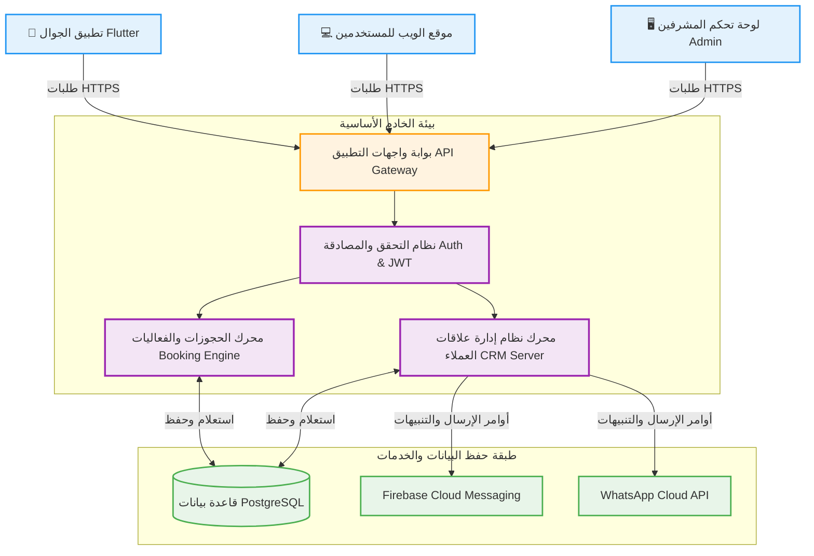
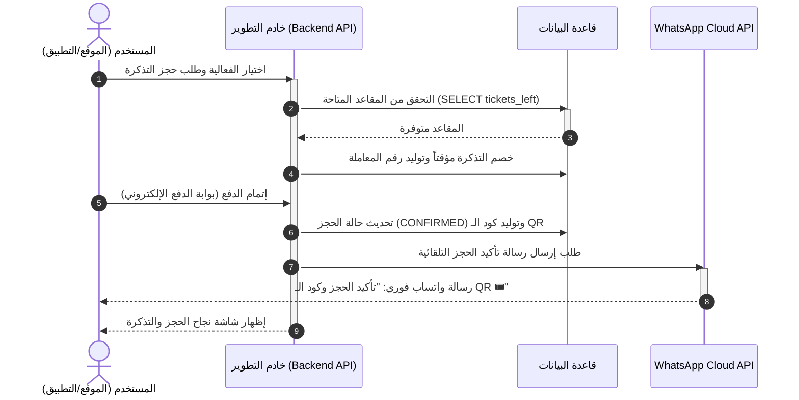
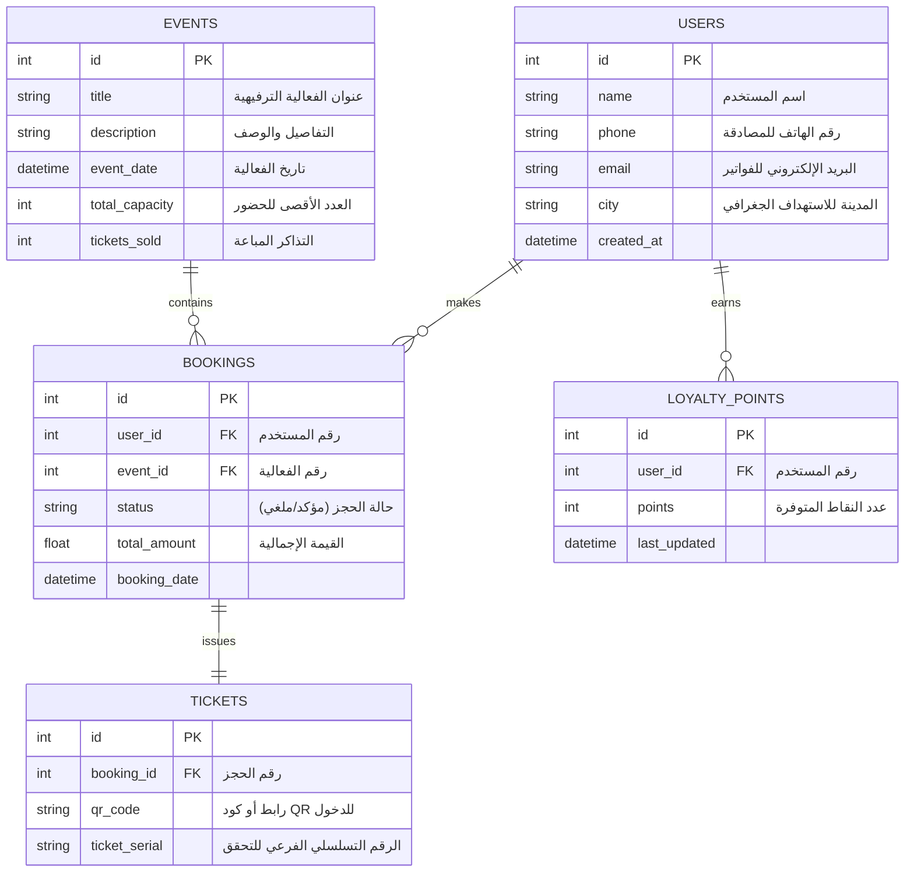

# 🏗️ الهيكل البرمجي وبنية النظام التقنية — TazakerKids Architecture

يوضح هذا المستند التصميم المعماري البرمجي (Software Architecture) المتكامل لمنصة **تذاكر كيدز (TazakerKids)**. يهدف التصميم إلى توفير بنية تحتية برمجية قابلة للتوسع والتحديث، مع ضمان أمان العمليات وسرعة حجز الفعاليات الترفيهية.

---

## 🛠️ التقنيات المستخدمة في البنية (Technology Stack)

| الطبقة البرمجية (Layer) | التقنية المقترحة (Technology) | الغرض التشغيلي (Purpose) |
| :--- | :--- | :--- |
| **📱 تطبيق الهاتف المحمول** | **Flutter / Dart** | كود موحد يدير واجهات المستخدم على نظامي Android و iOS بكفاءة وسرعة عالية. |
| **🎨 واجهة الويب (الموقع)** | **HTML5 / CSS3 / Modern Vanilla JS** | واجهة مستخدم متجاوبة تماماً مع الجوال والأجهزة اللوحية لتصفح الفعاليات. |
| **⚙️ الخادم والمنطق (Backend)** | **Node.js (Express) / Python (FastAPI)** | معالجة الطلبات وإدارة واجهات API، والمصادقة الآمنة عبر الـ JWT. |
| **🗄️ قاعدة البيانات (Database)** | **PostgreSQL / MySQL** | قاعدة بيانات علائقية لضمان موثوقية الحجوزات والمعاملات المالية وتفادي تضارب التذاكر. |
| **🔔 مركز التنبيهات الموحد** | **Meta WhatsApp Cloud API / Firebase FCM / NodeMailer** | إرسال رسائل الواتساب والبريد والتنبيهات الفورية على شاشات الهواتف تلقائياً. |

---

## 📡 1. مخطط تدفق البيانات للمنظومة (Unified System Architecture)

يوضح المخطط التالي كيفية ترابط مكونات النظام البرمجية من خلال واجهات التطبيقات (RESTful APIs):

---

## 🔁 2. تفاصيل تدفق عملية الحجز الفورية (Booking Data Flow)

يسلط المخطط التالي الضوء على مسار الطلب البرمجي منذ قيام المستخدم باختيار تذكرة وحتى تأكيد الحجز وإرسال التنبيهات عبر الواتساب:

---

## 🗄️ 3. مخطط هيكل قاعدة البيانات المبدئي (Entity Relationship Concept)

لضمان ربط منطقي سليم دون تكرار أو تعارض في البيانات، يعتمد النظام على الجداول الأساسية التالية:

---

## 🧠 ميزات تصميم النظام للأمان والاستمرارية (Architectural Highlights)

> [!TIP]
> * **فصل الصلاحيات (Separation of Concerns):** فصل لوحة تحكم المشرفين عن واجهات التطبيق لضمان استقرار الموقع والتطبيق حتى لو خضعت لوحة الإدارة لصيانة دورية.
> * **سرعة استجابة قواعد البيانات:** استخدام الفهرسة (Indexing) على حقول أرقام الهواتف والتواريخ لضمان استرجاع قائمة الفعاليات بشكل سريع وتفادي تأخير استجابة الخادم.
> * **التكامل السحابي الآمن:** تمرير كافة البيانات المالية والطلبات عبر بروتوكولات مشفرة بالكامل لحماية سرية وحقوق المستخدمين.

---

  <b>جميع الحقوق محفوظة © 2026 abdallah hany</b>

