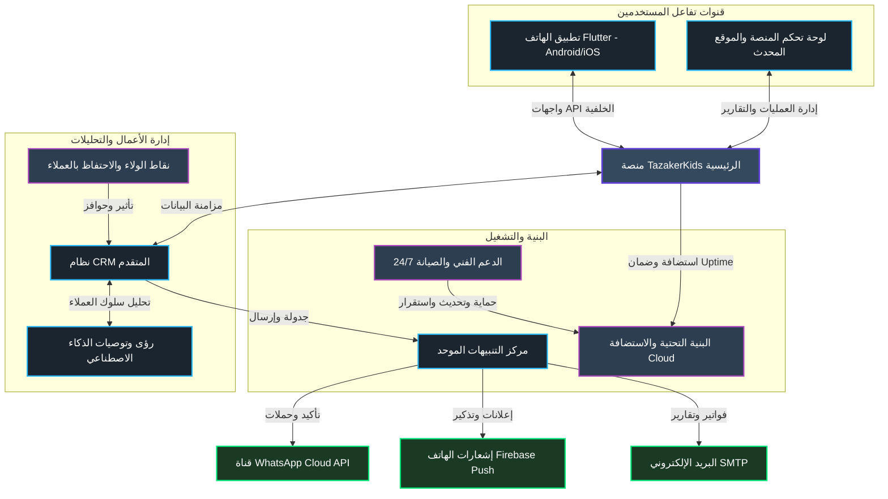
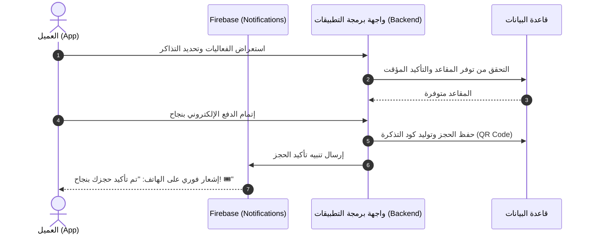

# 🚀 حزمة النمو للمؤسسات — TazakerKids Enterprise Growth Package

<p align="center">
  
  
  
  
</p>

---

## 🌟 تقديم عام (Introduction)

مرحباً بك في **حزمة النمو للمؤسسات (Enterprise Growth Package)** لمنصة **TazakerKids**. تم تصميم هذه الحزمة الاستراتيجية لنقل منصة الحجز والفعاليات الحالية إلى آفاق جديدة، وتحويلها إلى **بيئة أعمال رقمية متكاملة (Full Digital Ecosystem)** تجمع بين قوة التفاعل السريع عبر الهواتف الذكية، وذكاء إدارة العملاء المؤتمتة عبر لوحات الـ CRM المتقدمة، لتقديم تجربة مستخدم استثنائية وزيادة الحجوزات والمبيعات بشكل مضاعف.

---

## 🗺️ الهيكل العام للمنظومة (System Architecture)

يوضح المخطط الهيكلي التالي ترابط وتكامل مكونات حزمة النمو وكيفية تدفق البيانات بين المنصة والتطبيق ونظام الـ CRM ومركز التنبيهات:



---

## 📦 تفاصيل المكونات الرئيسية للحزمة (Core Modules)

انقر فوق الأقسام أدناه لاستكشاف الميزات والأساسيات التقنية والتشغيلية لكل مكون من مكونات حزمة النمو بالتفصيل:

<details>
<summary>📱 1. تطبيق الهاتف المحمول (Flutter Mobile App)</summary>

### الميزات الأساسية للتطبيق
* **أداء فائق واستجابة سريعة:** مبني بإطار العمل **Flutter** ككود برمجى موحد يعمل بكفاءة قصوى على كل من **Android** و **iOS**.
* **نظام التنبيهات الفورية (Firebase Push Notifications):** إرسال إشعارات تأكيد الحجز، وتذكير قبل بدء الفعاليات بـ 24 ساعة، والعروض الترويجية.
* **إدارة الحساب والمصادقة:** تسجيل دخول سريع ومرن برقم الهاتف (OTP) وربط الحساب بالشبكات الاجتماعية.
* **تصفح وحجز سلس:** واجهات ذكية ومريحة للعين تضمن تصفح الفعاليات وحجز التذاكر في أقل من دقيقة.

### رحلة حجز العميل (User Booking Sequence)

</details>

<details>
<summary>🎨 2. تحديث وتحسين واجهات تجربة المستخدم (Platform Modernization)</summary>

### تجديد الهوية البصرية وتجربة الاستخدام (UI/UX Redesign)
* **المظهر العصري:** تطبيق معايير تصميم المنتجات السحابية العالمية (SaaS UI) باستخدام تأثيرات زجاجية راقية (Glassmorphic) وخطوط متميزة وقراءة مريحة للعين.
* **التوافق التام (100% Responsive):** مواءمة تامة مع كافة الشاشات لتظهر لوحة الإدارة والموقع بشكل متناسق ومريح على الجوال أو الكمبيوتر.
* **تسهيل لوحة التحكم (Admin Workflows):** تبسيط إدارة الفعاليات ومتابعة الحجوزات المالية وتعديل تفاصيل العروض بمرونة تامة.

### نموذج من متغيرات نظام التصميم المقترح (Design System CSS)
```css
:root {
  --primary-color: #5D3FD3;        /* بنفسجي ملكي جذاب */
  --secondary-color: #00E676;      /* أخضر نيون متوهج للتفاعل */
  --dark-background: #0B0F19;      /* أزرق داكن جداً للخلفيات الفخمة */
  --card-glass: rgba(17, 24, 39, 0.75); /* تأثير زجاجي شبه شفاف */
  --border-glow: 1px solid rgba(255, 255, 255, 0.08);
}
```
</details>

<details>
<summary>💼 3. نظام إدارة علاقات العملاء المتقدم (Advanced CRM System)</summary>

يعد هذا النظام العمود الفقري لإدارة النشاط التجاري بالكامل وأتمتة التفاعل مع عملائك لزيادة مبيعاتك:

### الأقسام والميزات التفصيلية:

* **👥 إدارة بيانات العملاء (Customer Management):**
  * ملف شخصي متكامل لكل عميل يضم تفاصيل التواصل وسجل حجوزاته بالكامل.
  * مخطط زمني (Timeline) لتتبع تفاعل العميل وإنفاقه الإجمالي (LTV).

* **💬 إدارة عمليات الواتساب للأعمال (WhatsApp Business Operations):**
  * ربط متقدم مع **WhatsApp Cloud API** لإرسال حملات تسويقية وتذكيرية.
  * لوحة تحكم لتصميم قوالب الرسائل (Templates) المعتمدة وتتبع حالة وصولها (تم الإرسال 📤 -> تم التسليم 📥 -> تم القراءة 👁️).

* **🎯 شرائح العملاء الذكية (Smart Segments):**
  * **عملاء القيمة العالية (VIP):** كثر الحجوزات والإنفاق لتخصيص عروض ومكافآت مسبقة لهم.
  * **العملاء غير النشطين:** استهداف من لم يقم بأي حجز لـ 60 يوماً لإعادتهم بكوبونات ترويجية.
  * **التقسيم الجغرافي والسلوكي:** التوجيه حسب المدينة والاهتمامات (ترفيهي، تعليمي، إلخ).

* **⚙️ أتمتة التسويق (Marketing Automation):**
  * إطلاق حملات ترحيب تلقائية للعملاء الجدد، ورسائل تذكير قبل الفعاليات، واستبيانات تقييم الأداء والخدمة.

* **📊 لوحة التحليلات التنفيذية ورؤى الذكاء الاصطناعي (AI & Executive Dashboard):**
  * تحليلات مالية متقدمة للإيرادات وصافي الأرباح ومعدل التحويل (Conversion Tracking).
  * رصد التوجهات وتوصيات الذكاء الاصطناعي التلقائية لتحسين مبيعات الفعاليات القادمة.

* **🔒 الصلاحيات والدعم والتذاكر (Teams & Permissions / Tickets):**
  * نظام أدوار محكم (مدير، فريق تسويق، خدمة عملاء) لضمان سرية وسلامة البيانات.
  * مركز تذاكر مدمج (Ticketing Center) لحل مشكلات الحجوزات وتقديم الدعم للعملاء والرد عليهم بسرعة.
</details>

<details>
<summary>🔔 4. مركز التنبيهات الموحد (Notification Center)</summary>

توجيه ذكي ومؤتمت للإشعارات لضمان وصول الرسائل الهامة للعملاء بأعلى كفاءة:

### قنوات التنبيه وحالات استخدامها:
* **تأكيدات الحجز والتذاكر (WhatsApp):** يتم إرسال التذكرة الإلكترونية التفاعلية عبر الواتساب فور نجاح الدفع مباشرة كقناة تواصل رئيسية.
* **الفواتير والمرفقات الرسمية (Email):** إرسال الفاتورة الرسمية والتذاكر بصيغة **PDF** عبر البريد الإلكتروني.
* **التذكيرات العامة والإعلانات (Push Notification):** إشعارات لحظية ومجانية بالكامل تظهر على هواتف العملاء لتذكيرهم بمواعيد الفعاليات أو العروض الخاصة.

### جدول توجيه التنبيهات
| نوع الحدث | القناة الأساسية | القناة البديلة | الغرض التجاري |
| :--- | :--- | :--- | :--- |
| **تأكيد دفع الحجز** | WhatsApp | Push Notification | تأكيد سريع وطمأنة العميل. |
| **إرسال كود التذكرة QR** | WhatsApp | Email (PDF Attachment) | تيسير عملية الدخول للفعالية. |
| **استبيان تقييم الفعالية** | WhatsApp | Email | قياس رضا العميل وفتح تذاكر دعم في حال وجود شكوى. |
</details>

<details>
<summary>🌐 5. البنية التحتية والاستضافة (Infrastructure & Hosting)</summary>

استضافة سحابية آمنة ومستقرة لمدة عام كامل تضمن تشغيل المنصة بأعلى سرعة وتحت أي أحمال:

### أساسيات تشغيل البنية التحتية:
* **استضافة VPS سحابية متطورة:** تشغيل مستمر بنسبة توافر لا تقل عن **99.9% (Uptime)** مع حماية مدمجة ضد هجمات حجب الخدمة (DDoS).
* **تأمين البيانات وتشفيرها:** شهادة أمان **SSL (HTTPS)** مجانية لضمان تشفير بيانات المدفوعات والعملاء.
* **إستراتيجية نسخ احتياطي يومي (Daily Backup Strategy):** نسخ تلقائي ويومي لقواعد البيانات وتخزينها في خوادم سحابية خارجية معزولة (Off-site) لضمان استعادتها فوراً في أي سيناريو طارئ.
* **قابلية التوسع (Scalability):** إمكانية ترقية موارد المعالجة والذاكرة للمنظومة بسلاسة تامة لمواكبة التزايد المستمر للزوار.
</details>

<details>
<summary>🛠️ 6. الدعم الفني والصيانة لمدة عام كامل (Technical Support)</summary>

دعم كامل لضمان التشغيل السلس واستقرار المنظومة دون توقف:

### خدمات الدعم الفني المتاحة:
* **حل الأخطاء وتحديث التطبيقات:** حل فوري لأي مشاكل برمجية أو ثغرات تظهر بعد الإطلاق، وتحديث دوري لتطبيق الهواتف ليتوافق مع أنظمة تشغيل Android و iOS الحديثة.
* **المراقبة الأمنية والأداء:** مراقبة على مدار الساعة لأداء الخوادم واستقرارها لضمان تجربة حجز خالية من المشاكل.
* **الدعم التشغيلي والتدريب:** مساعدة فريق عمل TazakerKids في تهيئة لوحة الـ CRM، وتدريبهم على استخراج التقارير وتوزيع الأدوار والصلاحيات.

### اتفاقية مستوى الخدمة للدعم الفني (SLA)
* **🚨 المشكلات الحرجة (توقف الحجز/الدفع):** زمن استجابة في غضون **30 دقيقة** وحل للمشكلة في أقل من **4 ساعات**.
* **⚠️ المشكلات المتوسطة (عطل في ميزة فرعية):** زمن استجابة في غضون **2 ساعة** وحل للمشكلة في أقل من **12 ساعة**.
* **💡 التعديلات البسيطة والتحسينات:** زمن استجابة في غضون **12 ساعة** وجدولة الحل في غضون **48 ساعة**.
</details>

---

## 🎯 الفوائد الاستراتيجية للأعمال (Business Value)

> [!TIP]
> **كيف تساهم حزمة النمو في نجاح TazakerKids؟**
> * **زيادة معدل إتمام الشراء (Conversion Optimization):** تقليل نسبة ترك سلة المشتريات من خلال تصفح الهاتف السريع وتجربة الدفع المحسنة والموثوقة.
> * **خفض تكلفة جذب العميل الجديد (Customer Acquisition Cost):** إطلاق الحملات التسويقية الترويجية المجانية مباشرة عبر الواتساب واستهداف الشرائح المهتمة فقط.
> * **أتمتة خدمة العملاء والتقييم:** تقييم جودة الخدمة أوتوماتيكياً وتحويل العملاء غير الراضين لقسم الدعم الفني فوراً، مما يعزز ولاء العملاء وصورة العلامة التجارية.
> * **استقرار وأمان العمليات:** بنية تحتية سحابية قوية مدعومة بخطة نسخ احتياطي وحماية وحل فوري لأي عطل طارئ لضمان عدم خسارة أي مبيعات.

---
Developed with ❤️ for **TazakerKids** Growth Initiative.
