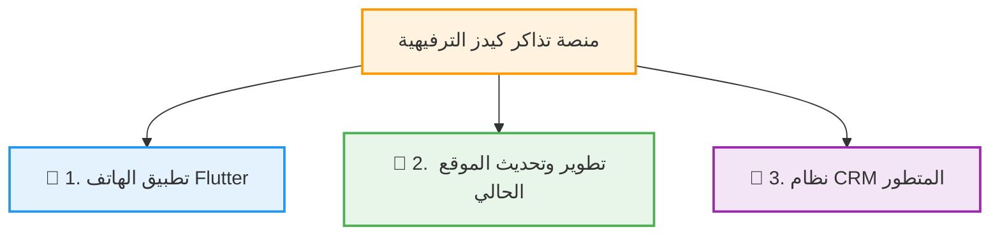

# 🎪 مشروع تطوير وتحديث منصة تذاكر كيدز — TazakerKids

  
  
  

---

## 🌟 الفكرة العامة للمشروع (Overview)

منصة **تذاكر كيدز (TazakerKids)** هي منصة متخصصة في حجز التذاكر للفعاليات والأنشطة الترفيهية والتعليمية المخصصة للأطفال. يهدف هذا المشروع إلى تطوير المنصة الحالية بالكامل لتقديم تجربة حجز أسرع وأسهل للمستخدمين، وتوفير أدوات إدارية وتسويقية متطورة لزيادة المبيعات والاحتفاظ بالعملاء.

---

## 🛠️ الركائز الأساسية للمشروع (Core Pillars)

يرتكز المشروع على **3 محاور رئيسية** تم تصميمها لتتكامل معاً بشكل مباشر وسلس:

---

### 📱 1. تطبيق الهاتف المحمول (Flutter Application)
تطوير تطبيق ذكي يعمل على نظامي **Android** و **iOS** ليكون القناة الأسرع لحجز فعاليات الأطفال الترفيهية:
* **حجز فوري مبسط:** تصفح الفعاليات الترفيهية واختيار التاريخ والوقت وحجز التذاكر في خطوات معدودة.
* **إشعارات وتنبيهات فورية:** إرسال التذاكر مباشرة للهاتف بعد الدفع، والتذكير بموعد الفعالية قبل بدئها.
* **دخول سريع وآمن:** تسجيل دخول مرن برقم الهاتف عبر رمز التحقق (OTP) أو الحسابات الاجتماعية للمستخدمين.
* **ربط كامل:** تكامل مباشر مع خوادم وقواعد بيانات المنصة الحالية لضمان تحديث التذاكر فورياً.

---

### 🎨 2. تطوير وتحديث الموقع الإلكتروني الحالي (Website Upgrade)
إعادة تصميم وتحسين الموقع الحالي لتقديم تجربة مستخدم ترفيهية، جذابة، وعصرية:
* **واجهات مستخدم محسنة:** تصميم جذاب ومريح للعين يسهل على المستخدمين استكشاف الفعاليات الترفيهية المتاحة.
* **توافق كامل مع الجوال (Responsive Design):** توافق تام وتلقائي للموقع عند تصفحه من شاشات الهواتف والأجهزة اللوحية.
* **تسهيل لوحة التحكم الإدارية:** تبسيط سير العمل للمشرفين لإضافة الفعاليات الترفيهية الجديدة، ومتابعة مبيعات التذاكر اليومية بسهولة.

---

### 💼 3. نظام إدارة علاقات العملاء المتطور (Advanced CRM)
بناء لوحة تحكم مخصصة لإدارة العمليات، والتواصل التلقائي مع المستخدمين لتشجيعهم على تكرار الحجز:
* **إدارة بيانات العملاء:** حفظ سجل كامل لكل عميل يشمل بيانات التواصل، والفعاليات المفضلة لديه، وسجل حجوزاته السابقة.
* **تكامل واتساب للأعمال (WhatsApp API):** إرسال التذاكر الذكية كرسائل واتساب تلقائية، وتتبع حالة استلامها وقراءتها.
* **أتمتة التسويق والولاء:**
  * جدولة رسائل تذكير تلقائية وحملات إعادة التنشيط للمستخدمين الذين انقطعوا عن الحجز.
  * إرسال استبيانات تقييم الخدمة بعد انتهاء الفعالية الترفيهية.
  * نظام نقاط ولاء مكافأة للعملاء الدائمين لاستبدالها بخصومات على الفعاليات القادمة.
* **إدارة الصلاحيات والفرق:** توزيع المهام داخل النظام بصلاحيات محددة لفريق التسويق وفريق دعم العملاء لحماية سرية البيانات.

---

## ⚙️ التشغيل والخدمات المساعدة (Operational Services)

لضمان عمل المنظومة السابقة بأعلى كفاءة واستقرار، يتضمن المشروع:
1. **مركز التنبيهات الموحد:** توجيه الإشعارات تلقائياً بحسب نوعها (تأكيد الحجز الفوري عبر WhatsApp، الفواتير عبر البريد الإلكتروني، والعروض العامة عبر إشعارات الهاتف).
2. **الاستضافة السحابية الآمنة:** استضافة سحابية مستقرة تضمن عمل الموقع والتطبيق بسرعة وبدون توقف، مع خطة نسخ احتياطي يومي لحماية كافة البيانات.
3. **الدعم الفني والصيانة:** دعم فني دوري لمعالجة أي مشاكل برمجية أو أخطاء تظهر بعد التشغيل وضمان استمرار عمل المنصة طوال العام.

---

## 🤝 الفوائد التجارية للمشروع (Business Value)

> [!TIP]
> * **تسهيل تجربة المستخدمين:** الحجز الفوري من الهاتف وتلقي التذاكر على الواتساب يمنع أي تعقيد ويزيد من رضا العملاء.
> * **مبيعات متكررة:** نظام أتمتة حملات الواتساب ونقاط الولاء يحفز المستخدمين على تكرار حجز الفعاليات الترفيهية.
> * **أمان واستمرارية:** استضافة محمية مع دعم فني وصيانة مستمرة تضمن عدم توقف الحجوزات أو ضياع التذاكر أبداً.

---

## 🔗 تفاصيل إضافية وشرح مفصل
لمراجعة المواصفات الدقيقة والشرح المفصل لكل خيار وميزة في المشروع، يرجى الانتقال إلى:
* 📖 [ملف التفاصيل الشاملة DETAILS.md](file:///c:/Users/hp/Downloads/tazaker%20kids%20ubdate/DETAILS.md)

---

  <b>جميع الحقوق محفوظة © 2026 abdallah hany</b>

